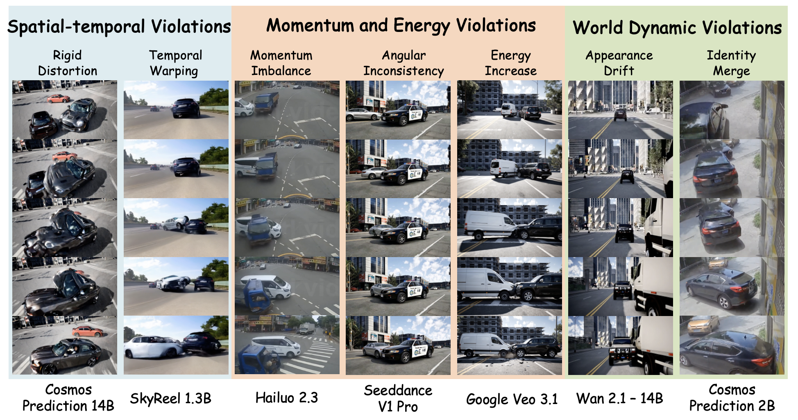

<div align="center">

# CrashTwin: A Physics-Grounded Benchmark for Multi-Agent Dynamics in World Models

<p>
  <a href="https://crash-twin.github.io/"></a>
  <a href="https://crash-twin.github.io/"></a>
  <a href="https://huggingface.co/datasets/nnuochen/crashtwin_data/blob/main/README.md"></a>
  <a href="https://huggingface.co/datasets/nnuochen/crashtwin_eval"></a>
  <a href="https://hub.docker.com/r/nuochen1203/crashtwin-preprocess"></a>
  <a href="https://hub.docker.com/r/nuochen1203/crashtwin-reconstruct"></a>
</p>

<p>
  <a href="https://nuochen1203.github.io/"><b>Nuo Chen</b></a><sup>1*</sup>,
  <a href="https://lulinliu.github.io/"><b>Lulin Liu</b></a><sup>1,2*</sup>,
  <a href="https://scholar.google.com/citations?user=7dLezg0AAAAJ&amp;hl=en"><b>Zihao Li</b></a><sup>1</sup>,
  <a href="https://adonis-galaxy.github.io/homepage/"><b>Ziyao Zeng</b></a><sup>3</sup>,
  <a href="https://scholar.google.com/citations?user=YfuA8zoAAAAJ&amp;hl=en"><b>Zihao Zhu</b></a><sup>1</sup>,
  <a href="https://www.wenyancong.com/"><b>Wenyan Cong</b></a><sup>4</sup>,
  <a href="https://jyhong.gitlab.io/"><b>Junyuan Hong</b></a><sup>4</sup>,
  <a href="https://yunhaoyang234.github.io/"><b>Yunhao Yang</b></a><sup>4</sup>,
  <a href="https://vztu.github.io/"><b>Zhengzhong Tu</b></a><sup>1</sup>,
  <a href="https://yanwang.org/"><b>Yan Wang</b></a><sup>5</sup>,
  <a href="https://www.borisivanovic.com/"><b>Boris Ivanovic</b></a><sup>5</sup>,
  <a href="https://web.stanford.edu/~pavone/index.html"><b>Marco Pavone</b></a><sup>5,6</sup>,
  <a href="https://vita-group.github.io/"><b>Zhangyang Wang</b></a><sup>4</sup>,
  <a href="https://engineering.tamu.edu/civil/profiles/zhou-yang.html"><b>Yang Zhou</b></a><sup>1</sup>,
  <a href="https://zhiwenfan.github.io/"><b>Zhiwen Fan</b></a><sup>1</sup>
  <br>
  <sup>1</sup>Texas A&amp;M University &nbsp;&nbsp;
  <sup>2</sup>University of Minnesota &nbsp;&nbsp;
  <sup>3</sup>Yale University &nbsp;&nbsp;
  <sup>4</sup>University of Texas at Austin &nbsp;&nbsp;
  <sup>5</sup>NVIDIA &nbsp;&nbsp;
  <sup>6</sup>Stanford University
  <br>
  <sup>*</sup>Equal contribution.
</p>



</div>

## Overview

Official code for **CrashTwin**, a physics-grounded evaluation framework for
world-model collision rollouts. Given a model's generated collision videos on
**CrashTwin-Eval**, the evaluator reconstructs metric-scale physical attributes
from monocular videos and reports the diagnostic scores used in the paper.

CrashTwin-Eval contains 300 synthetic and 44 real-world collision videos. Each
clip contains two collision actors and is evaluated with the same public
reconstruction-and-scoring protocol.

Use [CrashTwin-Data](https://huggingface.co/datasets/nnuochen/crashtwin_data/blob/main/README.md)
for training and post-training data. Use
[CrashTwin-Eval](https://huggingface.co/datasets/nnuochen/crashtwin_eval) for
the fixed 344-scenario evaluation set used for quantitative benchmarking.

## Installation

The host machine needs Bash, Docker, NVIDIA Container Toolkit, and
`huggingface-cli`. All CrashTwin Python code runs inside Docker.

```bash
git clone https://github.com/phai-lab/CrashTwin.git
cd CrashTwin

docker pull nuochen1203/crashtwin-preprocess:v1.0.0
docker pull nuochen1203/crashtwin-reconstruct:v1.0.0
```

The Docker images are hosted on Docker Hub:

- Preprocessing image: https://hub.docker.com/r/nuochen1203/crashtwin-preprocess
- Reconstruction image: https://hub.docker.com/r/nuochen1203/crashtwin-reconstruct

## Data Preparation

Training and post-training data are released separately as CrashTwin-Data:

https://huggingface.co/datasets/nnuochen/crashtwin_data/blob/main/README.md

To run the public evaluation protocol, download the CrashTwin-Eval files used
for quantitative benchmarking from Hugging Face:

https://huggingface.co/datasets/nnuochen/crashtwin_eval

From the repository root, run:

```bash
huggingface-cli download nnuochen/crashtwin_eval \
  --repo-type dataset \
  --local-dir .
```

The downloaded files include the benchmark CSV, per-video metadata, synthetic
first-frame images, first-frame processing scripts, and a checkpoint archive.
The evaluator does not download checkpoints automatically; unzip the checkpoint
archive before running evaluation:

```bash
unzip checkpoints/checkpoints.zip -d .
```

## Data Layout

After downloading CrashTwin-Eval and adding one model's generated videos, the
repository should look like this:

```text
CrashTwin/
├── benchmark/
│   ├── crashtwin_eval.csv
│   ├── auto_json/
│   │   └── <video_id>_auto.json
│   └── vehicle_specs/
│       └── <video_id>_vehicle_specs.json
├── checkpoints/
│   ├── droid.pth
│   ├── metric_depth_vit_giant2_800k.pth
│   ├── nuScenes_3Dtracking.pth
│   └── searaft/
│       └── Tartan-C-T-TSKH-kitti432x960-M.pth
├── first_frames/
│   └── <video_id>_frame_raw.png
├── assets/
│   └── trim_head_tail_package.zip
└── predictions/
    └── <model_name>/
        ├── <video_id>.mp4
        ├── <video_id>.mp4
        └── ...
```

The expected `video_id` values are listed in `benchmark/crashtwin_eval.csv`.
Generated videos may use any resolution or frame rate; the evaluator normalizes
them internally. Camera intrinsics are estimated from each input video, so fixed
camera parameters are not required.

## Run Evaluation

Evaluate one model from the host with:

```bash
bash scripts/evaluate.sh \
  --method-name <model_name> \
  --predictions predictions/<model_name> \
  --output outputs/<model_name> \
  --gpus 0,1,2,3
```

`scripts/evaluate.sh` starts the released Docker images with `docker run`. It
mounts the repository root to `/crashtwin` inside each container, so
`benchmark/`, `checkpoints/`, `predictions/`, and `outputs/` must all live
inside the cloned repository. The script also mounts `.cache/` to `/cache` so
downloaded model-hub files are reused across runs.

Use `--gpus 0` for a single GPU, or pass a comma-separated list such as
`--gpus 0,1,2,3` for multiple GPUs. For multi-GPU runs, the script splits the
benchmark rows across GPUs and starts one Docker container per GPU. Logs are
written to `outputs/<model_name>/logs/`.

## Outputs

The main result files are:

```text
outputs/<model_name>/
├── per_video_metrics.csv
├── summary_metrics.csv
├── failed_videos.csv
├── logs/
└── per_video/
```

`summary_metrics.csv` reports the aggregate CrashTwin-Eval scores.
`per_video_metrics.csv` contains one row per evaluated video, and
`failed_videos.csv` records clips that did not complete. Intermediate
preprocessing and reconstruction outputs are stored under
`outputs/<model_name>/per_video/`.

Each completed per-video folder keeps the JSON files used for scoring, the
bounding-box anchor PNG, the tracking/SAM2 videos, the Kalman-smoothed
trajectory video, and the visualization.

## Acknowledgements

CrashTwin builds on the following open-source projects:

- [DROID-SLAM](https://github.com/princeton-vl/DROID-SLAM) for camera motion estimation.
- [droid_metric](https://github.com/Jianxff/droid_metric) for DROID-SLAM and metric-depth integration utilities.
- [Metric3D](https://github.com/YvanYin/Metric3D) for metric depth reconstruction.
- [MapAnything](https://github.com/facebookresearch/map-anything) for intrinsic estimation.
- [SAM 2](https://github.com/facebookresearch/sam2) for video object segmentation.
- [SEA-RAFT](https://github.com/princeton-vl/SEA-RAFT) for optical flow.
- [CenterTrack](https://github.com/xingyizhou/CenterTrack) for monocular 3D vehicle detection and tracking.
- [OpenCLIP](https://github.com/mlfoundations/open_clip) for appearance-feature extraction.

We thank the authors of these projects for releasing their code and models.
Please refer to the corresponding files under `third_party/` for upstream
licenses and notices.
